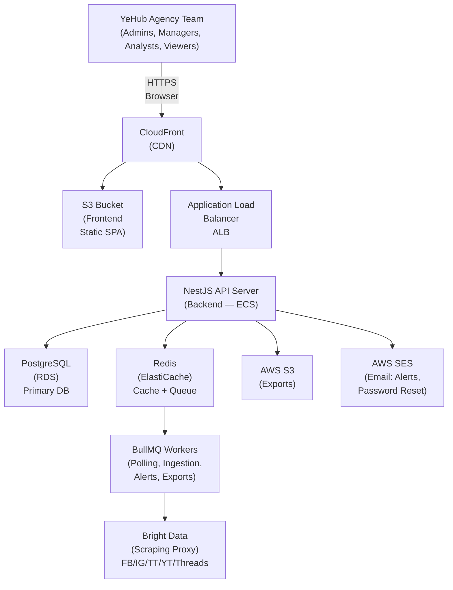
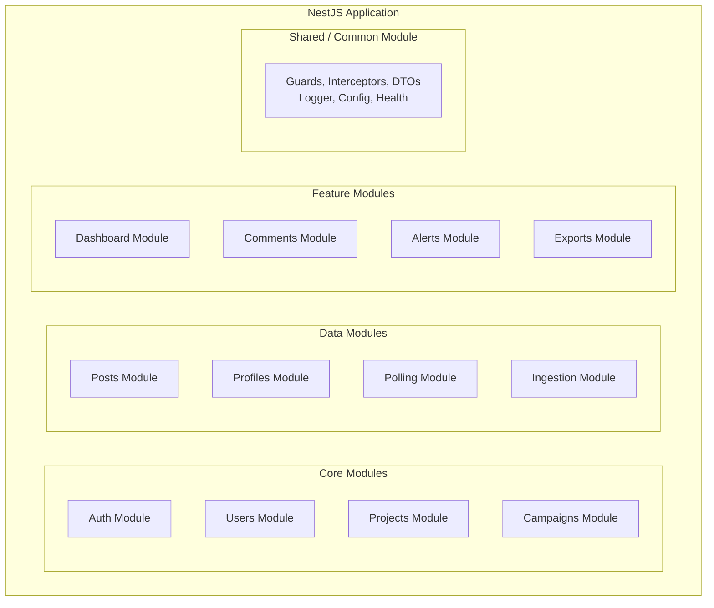
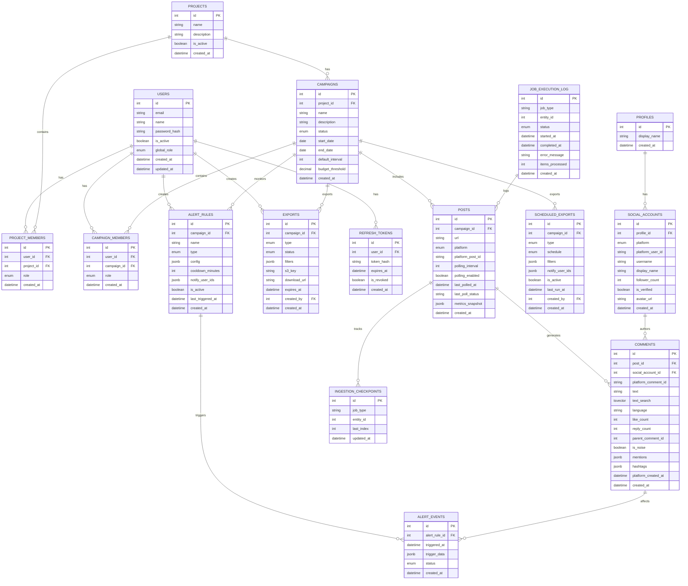
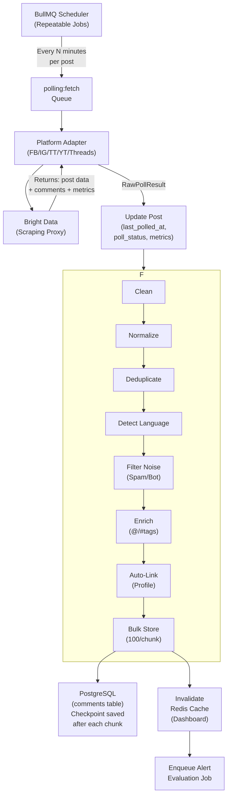
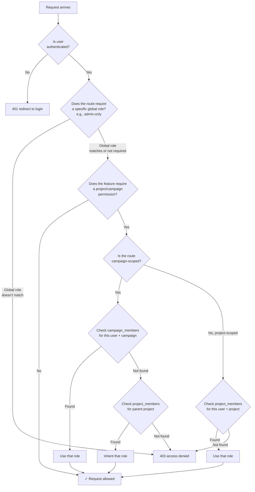
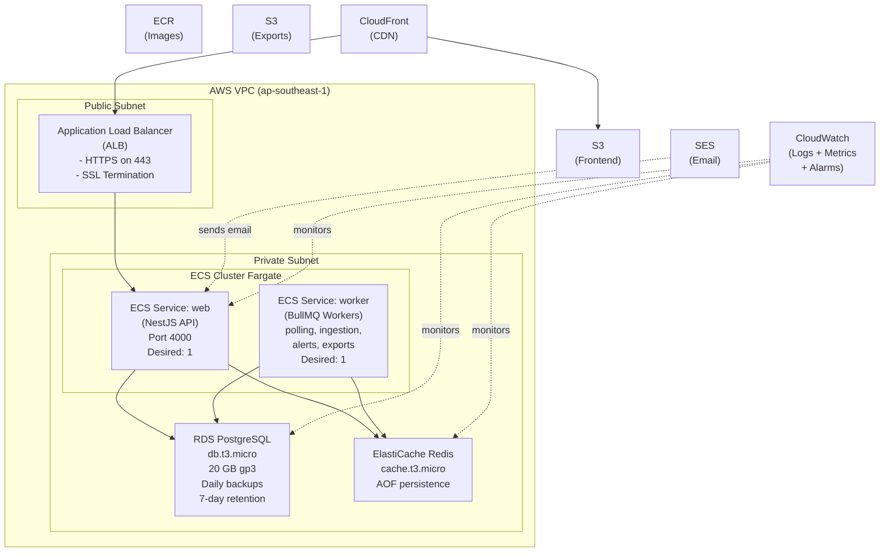
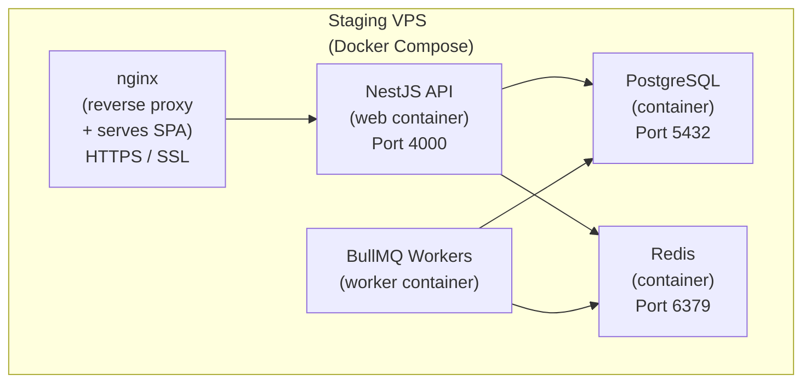
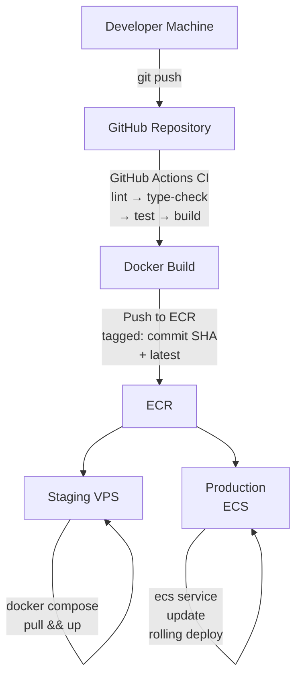
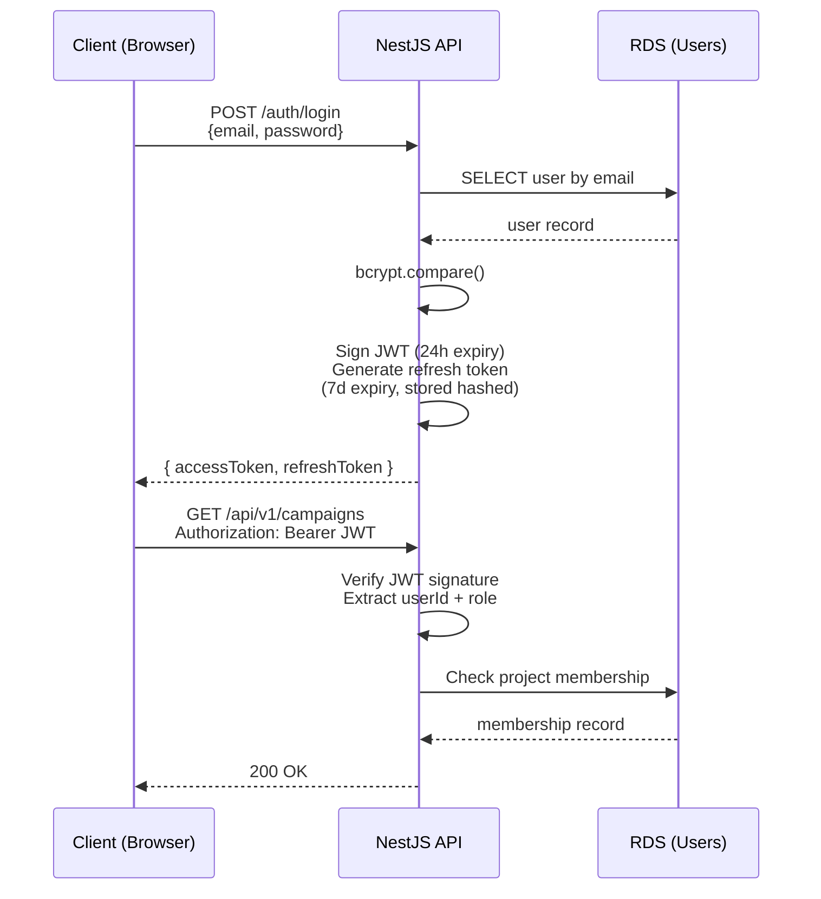

# Solution Architecture & Technical Design
## YeHub Social Listening Platform — Phase 1 (MVP)

**Document Version:** 1.0
**Date:** March 22, 2026
**Status:** Draft for Review

---

## 1. Context & Problem Statement

YeHub & Partners is a marketing agency in Ho Chi Minh City managing social media campaigns for multiple brand clients across Facebook, Instagram, TikTok, YouTube, and Threads. Their current workflow is entirely manual: team members visit each platform individually, copy comments and engagement metrics into spreadsheets, and compile reports by hand. This process is time-consuming (hours per day), error-prone, and fundamentally does not scale as the agency grows its client roster.

Phase 1 (MVP) replaces this manual workflow with an automated platform. The system collects data from all 5 social networks via Bright Data's scraping proxy, processes and normalizes it through a pipeline, stores it in a searchable database, and presents it through dashboards with Excel export for client reporting. The project timeline is 20 weeks with bi-weekly demo checkpoints.

The key architectural challenge is building a system that reliably polls thousands of social media posts on configurable schedules, processes the incoming data through a multi-step pipeline, and serves it through a responsive web UI — all while being operationally manageable by a small team (3 developers) and keeping AWS infrastructure costs lean.

### Constraints

The following constraints shape every architectural decision in this document:

**Team size:** 3 developers. No dedicated DevOps, DBA, or QA. Every technology choice must be something the team can operate, debug, and maintain without specialized expertise.

**Infrastructure cost:** AWS infrastructure should remain lean and predictable. Avoid expensive managed services unless they directly enable a core feature.

**Timeline:** 20 weeks from MVP kickoff to feature-complete, demo-ready system. Two-week sprints with bi-weekly checkpoints.

**Data volume (Phase 1):** Target scope is 50 active campaigns, 1000–5000 posts per campaign, 100K–500K comments collected over 6 months. Scaling to millions of comments is a Phase 2 problem.

**Operational complexity:** No dedicated DevOps. Deployment, monitoring, and incident response are handled by the development team. Infrastructure-as-code and automation are critical.

---

## 2. High-Level Architecture

### 2.1 Architecture Style: Modular Monolith

A **modular monolith** — a single NestJS application organized into well-separated modules, backed by BullMQ for async job processing. Each module owns its domain (entities, services, controllers, DTOs) and communicates with other modules through injected services (synchronous) or BullMQ jobs (asynchronous).

### 2.2 System Context Diagram



### 2.3 Component Architecture (NestJS Modules)

The NestJS backend is organized into the following modules. Each module owns its own entities, services, controllers, and DTOs. Cross-module communication happens through injected services (synchronous) or BullMQ jobs (asynchronous).



**Module responsibilities:**

- **Auth Module:** JWT issuance/validation, login, registration, password reset, refresh token rotation. JWT payload includes `userId` and `globalRole`. Owns the `refresh_tokens` table.
- **Users Module:** User CRUD, profile management. Owns the `users` table.
- **Projects Module:** Project CRUD, membership management. Owns `projects`, `project_members`, and `campaign_members` tables.
- **Campaigns Module:** Campaign CRUD, lifecycle management (Draft → Active → Paused → Stopped → Completed). Owns the `campaigns` table.
- **Posts Module:** Post CRUD, URL detection, bulk CSV upload, platform identification. Owns the `posts` table.
- **Profiles Module:** KOL/influencer profile management, social account linking. Owns `profiles` and `social_accounts` tables.
- **Polling Module:** BullMQ job scheduling, Bright Data platform adapters (Facebook, Instagram, TikTok, YouTube, Threads), retry logic, proxy health checks. Owns `poll_jobs` and `proxy_health` tables.
- **Ingestion Module:** Multi-step pipeline (Clean → Normalize → Deduplicate → Language Detect → Filter Noise → Enrich → Auto-Link → Store). Owns `ingestion_checkpoints` table.
- **Dashboard Module:** Aggregation queries, Redis caching, campaign comparison. No owned tables (reads from comments, posts, campaigns).
- **Comments Module:** Comment storage, full-text search (PostgreSQL tsvector), cursor-based pagination. Owns the `comments` table.
- **Alerts Module:** Alert rule CRUD, evaluation engine, cooldown management. Owns `alert_rules` and `alert_events` tables.
- **Exports Module:** Excel generation (exceljs), S3 upload, scheduled exports. Owns `exports` and `scheduled_exports` tables.
- **Shared Module:** Two-tier RBAC guards (GlobalRoleGuard + ProjectRoleGuard), JWT strategy, global exception filters, logging interceptor, config service, health check controller.

---

## 3. Technology Stack

### 3.1 Core Stack

| Layer | Technology | Version | Justification |
|---|---|---|---|
| **Backend Framework** | NestJS | 10.x | TypeScript-first, modular architecture, built-in DI, excellent decorator-based validation and guards. Large ecosystem. |
| **Frontend Framework** | Next.js | 14.x (Static Export) | React-based SPA, built as static files and deployed to S3 + CloudFront. API calls routed through CloudFront to ALB. |
| **Language** | TypeScript | 5.x | Type safety across the full stack reduces runtime bugs. Essential for a small team that can't afford extensive manual QA. |
| **Database** | PostgreSQL | 16 | Battle-tested relational DB. Native full-text search (tsvector + GIN index) eliminates the need for Elasticsearch in Phase 1. JSON columns for flexible metadata. |
| **Cache / Queue Broker** | Redis | 7.x | Dual-purpose: BullMQ job queue broker and dashboard data cache. One service, two critical roles. |
| **Job Queue** | BullMQ | 5.x | Mature Redis-based job queue for Node.js. Supports repeatable (cron) jobs, delayed retries, concurrency control, and job progress tracking. |
| **ORM** | TypeORM | 0.3.x | TypeScript entity decorators, migration support, query builder. Not the trendiest choice, but stable and well-documented. |
| **File Storage** | AWS S3 | — | Frontend static SPA hosting, export files, CSV uploads. Signed URLs for secure download. |
| **Email** | AWS SES | — | Password reset emails, alert notifications. Low cost at our volume (<1000 emails/month). |
| **CDN** | AWS CloudFront | — | Serves the frontend SPA from S3 and routes `/api/*` requests to the ALB. Single entry point for all traffic. |

### 3.2 Key Libraries

| Purpose | Library | Notes |
|---|---|---|
| Authentication | @nestjs/passport + passport-jwt | Industry-standard JWT handling with NestJS integration |
| Validation | class-validator + class-transformer | Decorator-based DTO validation on all API endpoints |
| Password Hashing | bcrypt | Min 10 rounds as specified in requirements |
| Excel Generation | exceljs | Full-featured .xlsx creation with formatting, charts, multiple sheets |
| CSV Parsing | papaparse | Robust CSV parsing for bulk post upload |
| Language Detection | cld3-asm or franc | Lightweight language detection for Vietnamese/English/other |
| HTTP Client | axios | For Bright Data API calls with timeout and retry support |
| Job Monitoring | @bull-board/nestjs | Web UI for monitoring BullMQ queues (admin-only) |
| API Documentation | @nestjs/swagger | Auto-generated Swagger docs from decorators |
| Logging | nestjs-pino | Structured JSON logging compatible with CloudWatch |

---

## 4. Data Architecture

### 4.1 Entity-Relationship Model



### 4.2 Key Schema Design Decisions

**Comments table is the largest table and needs the most care.** At scale target (50 campaigns, multiple posts per campaign), we expect 100K–500K comments in the first 6 months. The table uses a composite unique index on `(post_id, platform_comment_id)` for deduplication, a GIN index on `text_search` for full-text search, and a B-tree index on `(post_id, platform_created_at DESC)` for the comment feed.

**JSONB for flexible metadata.** Fields like `metrics_snapshot` (on posts), `config` (on alert rules), `mentions`, and `hashtags` use JSONB. This avoids schema changes every time a platform returns a new metric type or when we add a new alert config option. JSONB has excellent query support in PostgreSQL (indexable with GIN for containment queries).

**Enum types for controlled vocabularies.** Campaign status, platform, role, alert type, export type — these are all PostgreSQL ENUMs. This enforces data integrity at the database level and makes queries self-documenting.

**Soft deletes for users only.** Users are soft-deleted (is_active = false) to preserve audit trails. Posts, comments, and other entities use hard deletes — there's no business requirement for recovering deleted post data, and soft deletes add query complexity.

### 4.3 Full-Text Search Strategy

```sql
-- Comments table: auto-maintained tsvector column
ALTER TABLE comments ADD COLUMN text_search tsvector
  GENERATED ALWAYS AS (
    to_tsvector('simple', coalesce(text, ''))
  ) STORED;

CREATE INDEX idx_comments_text_search ON comments USING GIN (text_search);

-- Search query with ranking
SELECT id, text, ts_rank(text_search, query) AS rank
FROM comments,
     to_tsquery('simple', 'keyword1 & keyword2') query
WHERE text_search @@ query
  AND post_id IN (SELECT id FROM posts WHERE campaign_id = $1)
ORDER BY rank DESC
LIMIT 50 OFFSET 0;
```

We use the `simple` dictionary (not `english` or `vietnamese`) because comment text is multilingual and often contains slang, abbreviations, and emoji. The `simple` dictionary tokenizes on whitespace and lowercases — it doesn't try to stem words, which avoids mangling Vietnamese text. This is a deliberate tradeoff: we lose stemming (searching "running" won't match "run") but gain reliability across languages.

---

## 5. Data Flow Architecture

### 5.1 Polling & Ingestion Pipeline

This is the most architecturally significant flow in the system. It runs continuously in the background and is the core value delivery mechanism.



### 5.2 Platform Adapter Interface

Each social platform has quirks in how data is returned from Bright Data's scraping proxy. The adapter pattern abstracts these differences behind a common interface.

```typescript
// src/polling/adapters/platform-adapter.interface.ts

interface PlatformAdapter {
  readonly platform: Platform; // 'facebook' | 'instagram' | 'tiktok' | 'youtube' | 'threads'

  fetchPostData(url: string): Promise<RawPostData>;
  fetchComments(url: string, since?: Date): Promise<RawComment[]>;
  detectPostId(url: string): string | null; // Extract platform-specific post ID from URL
}

interface RawPostData {
  platformPostId: string;
  authorUsername: string;
  authorDisplayName: string;
  content: string;
  mediaUrls: string[];
  metrics: {
    likeCount: number;
    commentCount: number;
    shareCount: number;
    viewCount?: number;    // YouTube, TikTok
    reactionCount?: number; // Facebook
  };
  publishedAt: Date;
}

interface RawComment {
  platformCommentId: string;
  authorUsername: string;
  authorDisplayName: string;
  text: string;
  likeCount: number;
  replyCount: number;
  parentCommentId?: string; // For threaded replies
  publishedAt: Date;
}
```

### 5.3 BullMQ Queue Architecture

| Queue | Purpose | Concurrency | Retry Strategy | Cron / Trigger |
|---|---|---|---|---|
| `polling:fetch` | Post data collection | 5 | 3x exponential (1m, 5m, 15m); 429 → 30min backoff | Per-post interval |
| `ingestion:process` | Pipeline processing | 3 | 2x (checkpointed, resumes from last chunk) | After poll completion |
| `alerts:evaluate` | Rule evaluation | 2 | 1x (failed alerts logged but not retried) | After ingestion completion |
| `alerts:notify` | Email notifications | 1 (rate-limited: 10/min for SES) | 3x with backoff | After alert triggers |
| `exports:generate` | Excel file generation | 2 | No retry (user can re-trigger) | On-demand or scheduled |
| `system:health-check` | Proxy health pings | 1 | 1x (best effort) | Every 5 minutes |
| `system:campaign-expire` | Auto-complete campaigns | 1 | 1x | Daily at 00:00 UTC+7 |
| `exports:scheduled` | Recurring export trigger | 1 | 1x | Per-schedule (weekly Monday / monthly 1st) |

### 5.4 Caching Strategy

Redis serves dual duty: BullMQ broker and application cache. Cache keys follow a consistent namespace pattern for easy invalidation.

| Cache Key Pattern | TTL | Invalidation Trigger |
|---|---|---|
| `dashboard:campaign:{id}:{dateRange}` | 5 min | New ingestion batch completes for this campaign |
| `dashboard:compare:{hash(ids+range)}` | 5 min | New ingestion for any included campaign |
| `proxy:health:{platform}` | 5 min | Health check job completes |
| `user:permissions:{userId}` | 15 min | Project membership changes |

Total Redis memory estimate: <50 MB for Phase 1 scale. Production uses ElastiCache Redis (cache.t3.micro, 0.5 GB) for persistence and cross-service access. Staging uses a Redis Docker container on the VPS.

---

## 6. API Design

### 6.1 REST API Conventions

All API endpoints follow these conventions:

- **Base URL:** `/api/v1/`
- **Authentication:** `Authorization: Bearer <JWT>` on all endpoints except `/auth/login`, `/auth/register`, `/auth/forgot-password`, `/auth/reset-password`, `/health`
- **Pagination:** Cursor-based for feeds (comments), offset-based for admin lists (users, projects)
- **Error format:** `{ statusCode: number, message: string, error: string }`
- **Date format:** ISO 8601 (UTC) in responses; accept both UTC and Vietnam timezone in requests
- **Versioning:** URL-based (`/api/v1/`) for future backwards-compatible evolution

### 6.2 Core API Endpoints

```
AUTH
  POST   /api/v1/auth/register          — Create user (admin only)
  POST   /api/v1/auth/login             — Login, returns JWT + refresh token
  POST   /api/v1/auth/refresh-token     — Rotate access token
  POST   /api/v1/auth/forgot-password   — Send reset email
  POST   /api/v1/auth/reset-password    — Reset with token

USERS
  GET    /api/v1/users                  — List users (admin)
  GET    /api/v1/users/me               — Current user profile
  GET    /api/v1/users/:id              — User detail (admin)
  PATCH  /api/v1/users/:id              — Update user
  DELETE /api/v1/users/:id              — Soft-delete user (admin)

PROJECTS
  POST   /api/v1/projects               — Create project
  GET    /api/v1/projects               — List user's projects
  GET    /api/v1/projects/:id           — Project detail
  PATCH  /api/v1/projects/:id           — Update project
  POST   /api/v1/projects/:id/members   — Add member
  GET    /api/v1/projects/:id/members   — List members
  PATCH  /api/v1/projects/:id/members/:userId — Update role

CAMPAIGNS
  POST   /api/v1/campaigns              — Create campaign
  GET    /api/v1/campaigns/:id          — Campaign detail
  PATCH  /api/v1/campaigns/:id          — Update campaign
  POST   /api/v1/campaigns/:id/members  — Add member

POSTS
  POST   /api/v1/posts                  — Add single URL
  POST   /api/v1/posts/bulk             — CSV upload (multipart form)
  GET    /api/v1/campaigns/:id/posts    — List posts for campaign

COMMENTS (Full-Text Search)
  GET    /api/v1/campaigns/:id/comments — List with filters + search
  GET    /api/v1/campaigns/:id/comments/:id — Comment detail

DASHBOARD
  GET    /api/v1/campaigns/:id/dashboard — Aggregated campaign stats
  GET    /api/v1/dashboard/compare      — Multi-campaign comparison

ALERTS
  POST   /api/v1/alerts                 — Create alert rule
  GET    /api/v1/campaigns/:id/alerts   — List campaign alerts

EXPORTS
  POST   /api/v1/exports                — Generate on-demand export
  GET    /api/v1/campaigns/:id/exports  — List export history
  POST   /api/v1/exports/schedule       — Create scheduled export
  GET    /api/v1/exports/:id/download   — Download file (signed URL)
```

### 6.3 Authorization & RBAC

#### Global Roles

| Role | System-wide Permissions |
|---|---|
| **admin** | Full platform access. User management, project creation, all features. |
| **internal_user** | Manages profiles across the platform and monitors performance through dashboards and trending content. Cannot access system settings or manage users. |
| **authorized_user** | Standard access with no global module permissions. Can only work within the projects and campaigns they are assigned to. |

#### Project & Campaign Scoped Roles (within a project/campaign)

| Role | Permissions within Scope |
|---|---|
| **manager** | Full control. Edit campaigns, configure alerts, invite members, export, delete posts. |
| **executive** | Edit campaigns, view all data, cannot configure alerts or invite members. |
| **analyst** | View all data, search/filter comments, export, cannot edit campaigns. |
| **viewer** | View all data, cannot search, cannot export, cannot edit. |

#### Permission Matrix (Full Example)

TBD

#### Access Decision Flow



**Implementation:** Two NestJS guards working in sequence:

1. **`GlobalRoleGuard`** — Checks the user's global role (from the `users` table) against a `@GlobalRoles()` decorator. Applied to platform-wide routes (user management, admin settings, profiles).
2. **`ScopedRoleGuard`** — Resolves the user's effective role for the target project or campaign. For campaign-scoped routes, it first checks `campaign_members`, then falls back to `project_members` for the parent project (inheritance). Applied via a `@ScopedRoles()` decorator. The project/campaign ID is extracted from the route parameter.

Global role is checked first. If a user's global role grants access to a module (e.g., Profiles for `internal_user`), they can access it regardless of project membership. Scoped roles only apply within the context of a specific project or campaign.

---

## 7. Infrastructure & Deployment

### 7.1 Production Architecture (AWS ECS)

Production runs on AWS ECS (Elastic Container Service) with Fargate launch type. All application components are containerized and deployed as ECS services, giving us container orchestration, rolling deployments, and horizontal scaling without managing EC2 instances.



**ECS service design:** The application is split into two ECS services sharing the same Docker image but with different entrypoints:

- **web** — Runs the NestJS API server. Registered as an ALB target. Handles all HTTP traffic. The Next.js frontend is built as a static SPA and served from S3 via CloudFront (not part of this service).
- **worker** — Runs BullMQ workers (polling, ingestion, alerts, exports, scheduled jobs). No ALB target — only connects to Redis and PostgreSQL. Can be scaled independently if job throughput becomes a bottleneck.

### 7.2 Staging Architecture (Single VPS with Docker)

Staging runs on a single VPS (e.g., a low-cost cloud VPS or EC2 instance) with all services running as Docker containers via Docker Compose. This keeps staging cheap and simple while maintaining container parity with production.



The Docker Compose file defines the same service topology as production (web, worker, PostgreSQL, Redis), just running on a single machine. The same Docker images built by CI are used in both environments, ensuring behavioral parity.

### 7.3 CI/CD Pipeline & Deployment Strategy



**CI/CD pipeline (GitHub Actions):**

1. On push to `main`: lint, type-check, unit tests, build Docker image
2. On tag `v*` or merge to `main`: build → push to ECR → deploy to staging VPS via SSH (`docker compose pull && docker compose up -d`)
3. On manual trigger (production release): update ECS service with new task definition referencing the tagged image → ECS performs rolling deployment

### 7.4 Environment Strategy

| Environment | Purpose | Infrastructure |
|---|---|---|
| **Local** | Development | Docker Compose (PostgreSQL + Redis + API), hot-reload via volume mounts, frontend dev server |
| **Staging** | Demo + QA | Single VPS, Docker Compose, nginx (serves SPA + reverse proxies API), Let's Encrypt SSL |
| **Production** | Live system | Frontend SPA on S3 + CloudFront; API on ECS Fargate behind ALB; RDS, ElastiCache, SES |

---

## 8. Security Architecture

### 8.1 Authentication Flow



### 8.2 Security Measures

**Transport:** All traffic is TLS-encrypted. ALB terminates SSL with an ACM certificate. Internal traffic between ALB and ECS tasks is within the VPC private subnet.

**At rest:** RDS encryption enabled (AWS-managed keys). S3 bucket encryption (SSE-S3). ElastiCache encryption at rest enabled.

**Secrets management:** Database credentials, JWT secret, SES credentials, and Bright Data API key stored in AWS Secrets Manager. Injected at runtime via NestJS ConfigService — never committed to source code.

**Input validation:** Every API endpoint uses class-validator DTOs with whitelist mode (strips unknown properties). TypeORM parameterized queries prevent SQL injection.

**Rate limiting:** Auth endpoints: 10 requests/IP/minute via @nestjs/throttler. API endpoints: 100 requests/user/minute.

**CORS:** Configured to allow only the frontend domain (e.g., `https://app.yehub.vn`).

---

## 9. Observability & Monitoring

### 9.1 Logging Strategy

All application logs are structured JSON via `nestjs-pino`, shipped to CloudWatch Logs. Log levels: `error`, `warn`, `info`, `debug` (debug disabled in production).

Every log entry includes: `timestamp`, `level`, `requestId` (correlation ID from the HTTP request or BullMQ job ID), `userId` (if authenticated), `module`, `message`.

### 9.2 Key Metrics & Alarms

| Metric | Source | Alarm Threshold |
|---|---|---|
| CPU Utilization | ECS CloudWatch | > 80% for 5 minutes |
| BullMQ Queue Depth (all queues) | Custom CloudWatch metric | > 500 jobs waiting |
| Failed Job Count (per hour) | Custom CloudWatch metric | > 20 failures/hour |
| Polling Success Rate per Platform | Custom CloudWatch metric | < 90% over 1 hour |
| RDS Free Storage | RDS CloudWatch | < 5 GB remaining |
| 5xx Error Rate | ALB CloudWatch | > 5% of requests |
| API Response Time (p95) | Custom CloudWatch metric | > 2 seconds |

### 9.3 Job Audit Trail

Every BullMQ job execution writes a record to the `job_execution_log` table: job type, entity ID, start/end time, status, items processed, error message. This provides a complete audit trail for debugging data collection issues — "why is this post missing comments from March 15?" becomes a simple query.

---

## 10. Implementation Roadmap

### Phase 1 Sprint Plan (aligned with demo milestones)

**Sprint 1-2 (Weeks 1-4): Foundation**
- NestJS project scaffolding with module structure
- PostgreSQL schema + TypeORM entities + initial migration
- Auth Module (JWT, login, register, password reset, RBAC guards)
- Users Module (CRUD, profile)
- CI/CD pipeline (GitHub Actions)
- Local development environment (Docker Compose)
- *Milestone: Demo 1 — Login, User & Role Management*

**Sprint 3-4 (Weeks 5-8): Core Data Model**
- Projects Module (CRUD, membership)
- Campaigns Module (CRUD, lifecycle management)
- Posts Module (single URL add, platform detection, bulk CSV upload)
- Profiles Module (auto-creation stubs, social account management)
- *Milestone: Demo 2 — Project & Campaign Management*

**Sprint 5-6 (Weeks 9-12): Data Collection Engine**
- Polling Module (BullMQ scheduler, repeatable jobs)
- Platform Adapters (5 adapters for FB/IG/TT/YT/Threads)
- Retry logic + error handling + proxy health checks
- Ingestion Pipeline (all 8 steps)
- Checkpoint/resume for large batches
- Comments table with full-text search index
- *Milestone: Demo 3 — Post Monitoring & Data Collection*

**Sprint 7-8 (Weeks 13-16): Dashboards & Features**
- Dashboard Module (campaign overview, comparison, post detail)
- Redis caching layer for dashboard queries
- Comment feed with cursor pagination and filters
- Alert system (rules, evaluation, email notifications)
- Export Module (on-demand Excel, scheduled exports, S3 storage)
- *Milestone: Demo 4 — Dashboards, Alerts & Export*

**Sprint 9 (Weeks 17-18): Polish & Testing**
- Integration testing for critical flows (auth → polling → ingestion → alerts)
- Performance testing (simulate 50 campaigns, 1000 posts)
- Bug fixes from demo feedback
- Swagger API documentation complete

**Sprint 10 (Weeks 19-20): Deployment & Handover**
- AWS production environment setup
- Staging → Production migration
- User training for YeHub team
- UAT support and critical bug fixes
- *Milestone: MVP Feature Complete + Deployment*

### Key Checkpoints

After Sprint 2: The auth + RBAC system works end-to-end. If this takes longer than planned, it signals the team velocity is lower than estimated and the sprint plan needs adjustment.

After Sprint 6: The polling pipeline collects real data from at least 3 of 5 platforms. This is the highest-risk milestone — if proxy integration is harder than expected, we learn here (not at sprint 9).

After Sprint 8: All "Must" priority features are functional. Sprints 9-10 are buffer for testing and deployment. If we're behind, "Should" priority features (campaign comparison, scheduled exports, chunked processing) can be deferred to a post-MVP patch.

---

## 11. Revisit Triggers

These are specific conditions that should cause us to reconsider architectural decisions made in this document:

**Consider adding a dedicated search engine (e.g., Elasticsearch) when:**
- Comment search queries consistently exceed 500ms latency despite proper indexing
- Total comment count exceeds 2M rows and PostgreSQL partitioning is insufficient
- Future phases require faceted search, fuzzy matching, or cross-campaign text analytics

**Scale ECS services horizontally when:**
- The web service consistently uses >80% CPU/memory during peak hours
- API response times degrade under concurrent dashboard + polling load
- BullMQ worker job processing lag exceeds 5 minutes (scale worker service independently)

**Split the monolith into services when:**
- Phase 2 AI processing requires Python (natural service boundary)
- BullMQ workers need independent scaling from the API server
- Two modules have conflicting resource requirements (CPU-bound processing vs I/O-bound API)

**Upgrade ECS task resources when:**
- CPU utilization consistently >70% during peak polling hours
- Memory usage >80% (Node.js heap pressure)
- Fargate task size can be increased from 0.5 vCPU / 1 GB to larger configurations without code changes

**Add a read replica for PostgreSQL when:**
- Dashboard queries slow down under concurrent polling writes
- Database CPU >70% sustained
- Need to run analytics queries without impacting operational performance

---

## 12. Risks and Mitigations

**Risk: Bright Data proxy reliability.** The entire data collection depends on Bright Data's scraping infrastructure. If Bright Data goes down or changes its API, all polling stops.
*Mitigation:* Proxy health monitoring with email alerts. Adapter pattern makes it possible to swap to an alternative proxy provider per-platform if needed. Design polling jobs to be idempotent so missed polls can be backfilled.

**Risk: Platform-specific data format changes.** Social media platforms frequently change their HTML structure, which can break Bright Data's scraping endpoints.
*Mitigation:* Each platform adapter is isolated. A broken Facebook adapter doesn't affect YouTube collection. The adapter logs raw responses on failure for debugging. Bright Data typically updates their scrapers within days of platform changes.

**Risk: Data volume exceeds PostgreSQL full-text search capacity.** If a campaign goes viral and generates 100K+ comments in a week, search performance could degrade.
*Mitigation:* Monitor query latency. PostgreSQL can handle millions of rows with proper indexing (tsvector + GIN). Additional strategies include table partitioning by campaign or date range, and query optimization with materialized views for dashboard aggregations.

**Risk: Service availability during deployments or failures.** If a container crashes, the application is temporarily unavailable until ECS replaces it.
*Mitigation:* ECS Fargate performs health-check-based container replacement automatically. Rolling deployments ensure zero downtime during releases. RDS and ElastiCache are managed services with their own HA. For Phase 1 with <20 users, the default ECS recovery (typically <60 seconds) is acceptable. Future phases can increase desired count to 2+ for the web service.

**Risk: BullMQ job queue backup during proxy rate limiting.** If the proxy rate-limits us, jobs back up and processing falls behind schedule.
*Mitigation:* Adaptive concurrency — when 429 errors are detected, reduce polling concurrency and increase backoff. CloudWatch alarm on queue depth >500 alerts the team. Jobs are persistent in Redis (AOF) so they survive restarts.

---

## 13. Phase 2 & 3 Architectural Considerations

While we're not building for Phase 2 and 3 today, these future requirements inform our Phase 1 decisions:

**Phase 2 (AI Analysis):** Sentiment analysis, emotion detection, topic clustering. This will likely require a Python service (for ML libraries like transformers, spaCy). The modular monolith + BullMQ architecture supports this naturally: the Python service consumes jobs from a new BullMQ queue, processes comments, and writes results back to PostgreSQL. No changes to the NestJS API are needed beyond adding new response fields.

**Phase 3 (Advanced Features):** PDF reports, SSO, public API. PDF generation can use a Node.js library (puppeteer or pdfkit) within the existing monolith. SSO (Google, Microsoft) extends the Auth module with passport strategies. A public API is a new set of controllers with API key authentication — the existing service layer is reused.

The key architectural decision that enables all of this: **PostgreSQL as the single source of truth.** Every future feature reads from and writes to the same database. We don't have data scattered across services. This is the biggest advantage of the modular monolith approach for a small team.

---

*End of Document*
