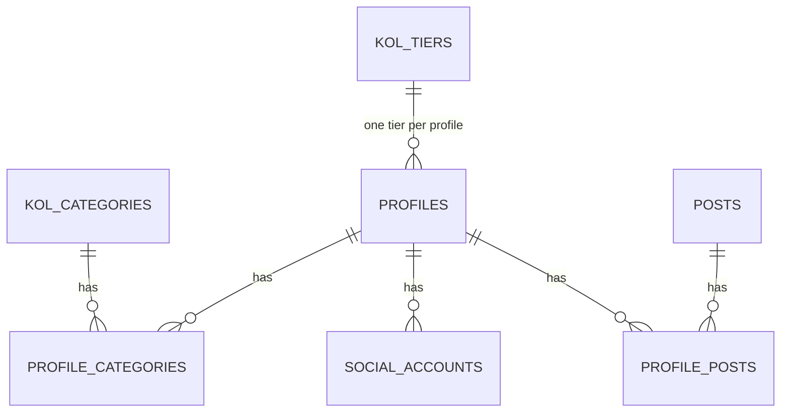

# Feature Specification: KOL/Influencer Profile Management

**Sections:** 5.3, 5.4, 5.5
**Priority:** Required
**Date:** 2026-04-18

---

## Table of Contents

1. [Overview](#1-overview)
2. [Data Model](#2-data-model)
3. [Feature 5.4: KOL Category Management](#3-feature-54-kol-category-management)
4. [Feature 5.5: KOL Tier Management](#4-feature-55-kol-tier-management)
5. [Feature 5.3: KOL/Influencer Profile Management](#5-feature-53-kolininfluencer-profile-management)
6. [API Endpoints](#6-api-endpoints)
7. [Authorization](#7-authorization)

---

## 1. Overview

This document specifies three tightly coupled features for managing KOL/influencer profiles within the YeHub Social Listening platform. Categories and Tiers are master data that Profiles reference, so they are defined first.

**Dependency order:** KOL Categories & KOL Tiers (no dependencies) → KOL Profiles (depends on both).

**Tech stack alignment:** The backend uses **NestJS 11 + Prisma 7 + PostgreSQL 17** (not TypeORM as noted in the Solution Architecture doc — the architecture doc is outdated on this point). All IDs use **UUID** (not SERIAL integers). Prisma schema lives at `yehub-be/prisma/schema.prisma`.

### Frontend Implementation Strategy

The `yehub-demo` app already contains working UI for most of these features (mock data, no real API calls). When implementing in `yehub-fe`:

- **Copy demo code directly** for screens/components that already exist in `yehub-demo/src/pages/profiles/`. The layout, styling, and component structure should be the same.
- **Replace mock data** with real API calls using TanStack React Query hooks.
- **Replace hardcoded lists** (categories, tiers) with data fetched from the API.
- **Add missing screens** (linked posts table, post re-linking) that the demo does not have yet.

---

## 2. Data Model

> **Note on existing schema:** The current `profiles` table (Prisma model `Profile`) has: `id` (UUID), `name` (String), `description` (String?), `tags` (String[]). It does **not** have `created_at`, `updated_at`, `display_name`, or any of the fields listed in the Solution Architecture doc's ER diagram. The actual codebase schema is the source of truth.

### 2.1 New Entities

#### `kol_categories`

Prisma model: `KolCategory`

| Column | Type | Constraints | Description |
|---|---|---|---|
| `id` | `UUID` | PK, @default(uuid()) | |
| `name` | `String` | UNIQUE, NOT NULL | e.g. Beauty, Tech, Food |
| `description` | `String?` | nullable | Short description of the category |
| `color` | `String` | NOT NULL, DEFAULT `'blue'` | Color key for UI display (maps to a preset palette) |
| `created_at` | `DateTime` | NOT NULL, @default(now()) | |
| `updated_at` | `DateTime` | NOT NULL, @updatedAt | |

#### `kol_tiers`

Prisma model: `KolTier`

| Column | Type | Constraints | Description |
|---|---|---|---|
| `id` | `UUID` | PK, @default(uuid()) | |
| `name` | `String` | UNIQUE, NOT NULL | e.g. Nano, Micro, Macro, Mega |
| `description` | `String?` | nullable | Short description of the tier |
| `color` | `String` | NOT NULL, DEFAULT `'blue'` | Color key for UI display |
| `min_followers` | `Int` | NOT NULL, DEFAULT 0 | Lower bound of follower range |
| `max_followers` | `Int?` | nullable | Upper bound (NULL = no limit) |
| `created_at` | `DateTime` | NOT NULL, @default(now()) | |
| `updated_at` | `DateTime` | NOT NULL, @updatedAt | |

### 2.2 Modified Entities

#### `profiles` (extended from current schema)

Current Prisma schema:
```prisma
model Profile {
  id          String   @id @default(uuid()) @db.Uuid
  name        String
  description String?
  tags        String[]
  socialAccounts SocialAccount[]
  @@map("profiles")
}
```

New columns to add:

| Column | Type | Constraints | Description |
|---|---|---|---|
| `gender` | `Enum Gender` | nullable | Values: `MALE`, `FEMALE`, `OTHER` |
| `email` | `String?` | nullable | Contact email |
| `phone` | `String?` | nullable | Contact phone number |
| `tier_id` | `UUID?` | FK → `kol_tiers.id`, ON DELETE SET NULL | One tier per profile |
| `created_at` | `DateTime` | NOT NULL, @default(now()) | Currently missing — must be added |
| `updated_at` | `DateTime` | NOT NULL, @updatedAt | Currently missing — must be added |

Existing `tags` field is already `String[]` (Prisma native array) — no change needed.

**On `tier_id` SET NULL:** Deleting a tier does not delete profiles — it clears their tier assignment.

#### `profile_categories` (new junction table)

Prisma implicit many-to-many or explicit join table:

| Column | Type | Constraints |
|---|---|---|
| `profile_id` | `UUID` | FK → `profiles.id` ON DELETE CASCADE |
| `kol_category_id` | `UUID` | FK → `kol_categories.id` ON DELETE CASCADE |

**PK:** Composite `(profile_id, kol_category_id)`

**On CASCADE:** Deleting a category removes the association rows but does not affect the profile itself. Deleting a profile removes all its category associations.

### 2.3 Existing Entity — `social_accounts`

Current Prisma schema:
```prisma
model SocialAccount {
  id               String   @id @default(uuid()) @db.Uuid
  profile_id       String   @db.Uuid
  platform         Platform   // FACEBOOK | INSTAGRAM | TIKTOK | YOUTUBE | THREADS
  platform_user_id String
  username         String?
  display_name     String?
  follower_count   Int      @default(0)
  is_verified      Boolean  @default(false)
  profile  Profile   @relation(...)
  comments Comment[]
  @@unique([platform, platform_user_id])
  @@index([profile_id])
  @@map("social_accounts")
}
```

**Fields missing vs demo UI / requirements:**
- `avatar_url` — Demo shows avatars per account. Need to add `String?` column.
- `created_at` — Need to add `DateTime @default(now())`.

**Note:** The demo UI disables linking a second account on the same platform to one profile. However, the DB schema uses `@@unique([platform, platform_user_id])` (unique per platform + platform ID), which already allows multiple accounts on the same platform for different profiles. The UI restriction is a UX choice, not a schema constraint — keep the schema flexible.

**New index for URL search:**

```sql
-- Requires: CREATE EXTENSION IF NOT EXISTS pg_trgm;
CREATE INDEX idx_social_accounts_username_trgm
  ON social_accounts USING GIN (username gin_trgm_ops);
```

This enables `ILIKE '%keyword%'` search on username to support the "search by social media URL" requirement (URLs contain the username).

### 2.4 Profile ↔ Post Relationship

Posts are currently linked to profiles indirectly: `profiles → social_accounts → comments (via social_account_id) → posts (via post_id)`.

The requirement asks for "danh sách Post đã theo dõi" (tracked posts linked to a profile). This requires a direct link:

#### `profile_posts` (new junction table)

Prisma model: `ProfilePost`

| Column | Type | Constraints |
|---|---|---|
| `profile_id` | `UUID` | FK → `profiles.id` ON DELETE CASCADE |
| `post_id` | `UUID` | FK → `posts.id` ON DELETE CASCADE |
| `linked_by` | `Enum LinkedBy` | NOT NULL, DEFAULT `AUTO` | Values: `AUTO`, `MANUAL` |
| `created_at` | `DateTime` | NOT NULL, @default(now()) | |

**PK:** Composite `(profile_id, post_id)`

This table supports:
- Auto-linking during ingestion (when a post's author matches a social account)
- Manual re-linking by users (when the system misidentifies the author)

### 2.5 ER Diagram (new/modified entities only)



---

## 3. Feature 5.4: KOL Category Management

### 3.1 Acceptance Criteria

| # | Criterion | Implementation |
|---|---|---|
| 1 | Create category with name, description, color | POST endpoint + Create dialog with name (required), description (optional), color picker |
| 2 | Edit existing category | PATCH endpoint + Edit dialog |
| 3 | Delete category without affecting linked profiles | DELETE endpoint. `profile_categories` rows cascade-deleted, profile itself untouched |
| 4 | One profile can have multiple categories | Many-to-many via `profile_categories` junction table |
| 5 | Profile count per category displayed in list | Aggregate query: `COUNT(profile_categories.profile_id) WHERE kol_category_id = ?` |

### 3.2 UI Screens

**Source:** Copy from `yehub-demo/src/pages/profiles/SegmentsPage.tsx`. Rename to `CategoriesPage.tsx` in `yehub-fe`.

**Route:** `/profiles/categories` (defined in `ROUTES.CATEGORIES`)

#### Categories List Page

The demo UI is complete for this page. Copy as-is with these changes:
1. Replace `mockCategories` with `useQuery` hook calling `GET /v1/kol-categories`.
2. Replace `toast.success('Category created')` in form submit with `useMutation` calling `POST /v1/kol-categories`, invalidate query on success.
3. Replace `toast.success('Category updated')` with `useMutation` calling `PATCH /v1/kol-categories/:id`.
4. Replace `toast.success('Category deleted')` with `useMutation` calling `DELETE /v1/kol-categories/:id`. Add a confirmation dialog (AlertDialog) before deletion warning that profiles will be unlinked.

**Layout (keep from demo):**
- Header: Title "Categories", description "Organize profiles into categories for targeted analysis", "Add Category" button
- Table (shadcn Table): Category (color badge + name) | Description | Profiles (count, center, mono) | Actions (edit + delete ghost buttons)
- Empty state: Tag icon + "No categories yet"
- Create/Edit dialogs: Name (required), Description (textarea, 3 rows), ColorSwatchPicker

### 3.3 Business Rules

- Category `name` must be unique (case-insensitive)
- Deleting a category removes all `profile_categories` associations but does **not** modify profiles
- Color is selected from a fixed preset palette (same palette used across the app)

---

## 4. Feature 5.5: KOL Tier Management

### 4.1 Acceptance Criteria

| # | Criterion | Implementation |
|---|---|---|
| 1 | Create tier with name, description, color | POST endpoint + Create dialog |
| 2 | Edit existing tier | PATCH endpoint + Edit dialog |
| 3 | Delete tier without affecting linked profiles | DELETE endpoint. `profiles.tier_id` set to NULL via ON DELETE SET NULL |
| 4 | Each profile assigned exactly one tier | `profiles.tier_id` FK (nullable, single value) |
| 5 | Profile count per tier displayed in list | Aggregate query: `COUNT(profiles.id) WHERE tier_id = ?` |

### 4.2 UI Screens

**Source:** Copy from `yehub-demo/src/pages/profiles/TiersPage.tsx`.

**Route:** `/profiles/tiers` (defined in `ROUTES.TIERS`)

#### Tiers List Page

The demo UI is complete for this page. Copy as-is with these changes:
1. Replace `mockTiers` with `useQuery` hook calling `GET /v1/kol-tiers`.
2. Replace form submit toasts with `useMutation` calling `POST /v1/kol-tiers` (create) and `PATCH /v1/kol-tiers/:id` (update).
3. Replace delete toast with `useMutation` calling `DELETE /v1/kol-tiers/:id`. Add AlertDialog confirmation warning that profiles will have their tier cleared.

**Layout (keep from demo):**
- Header: Title "Tiers", description "Classify profiles by follower count and influence level", "Add Tier" button
- Card list (one Card per tier, `space-y-3`): Tier badge + Description + Follower range | Profile count + Edit/Delete buttons
- Empty state: Award icon + "No tiers yet"
- Create/Edit dialogs: Name, Description, Min/Max Followers, ColorSwatchPicker

### 4.3 Business Rules

- Tier `name` must be unique (case-insensitive)
- `min_followers` must be >= 0
- `max_followers` must be > `min_followers` when provided
- Follower ranges are informational — they do not auto-assign tiers (admin assigns manually)
- Deleting a tier sets `profiles.tier_id = NULL` for all affected profiles

---

## 5. Feature 5.3: KOL/Influencer Profile Management

### 5.1 Acceptance Criteria

| # | Criterion | Implementation |
|---|---|---|
| 1 | List all profiles with search by name | GET endpoint with `?search=` param. DataTable with SearchBar |
| 2 | Profile displays: name, social accounts, linked posts | Profile detail page with social accounts card + linked posts list |
| 3 | Auto-create profile on new author during ingestion | Ingestion pipeline "Auto-Link" step creates profile + social_account if author not found |
| 4 | Manual re-link post to correct profile | UI action on post or profile detail to change `profile_posts` assignment |
| 5 | Manual profile creation | Dedicated "Add Profile" page with full form |
| 6 | Additional info: gender, email, phone, custom tags | Fields on profile entity, editable via create/edit forms |
| 7 | Assign one tier + multiple categories | Tier dropdown (single select) + Category checkboxes (multi-select) on forms |
| 8 | Search by name or social media URL | Search param matches against `profiles.name` OR `social_accounts.username` (extracted from URL) |

### 5.2 UI Screens

**Source files to copy from `yehub-demo`:**

| Demo File | Copy to `yehub-fe` | Status |
|---|---|---|
| `pages/profiles/ProfilesListPage.tsx` | Same path | Copy + adapt (see changes below) |
| `pages/profiles/AddProfilePage.tsx` | Same path | Copy + adapt |
| `pages/profiles/ProfileDetailPage.tsx` | Same path | Copy + adapt + add linked posts section |
| `pages/profiles/components/EditProfileDialog.tsx` | Same path | Copy + adapt |
| `pages/profiles/components/LinkAccountDialog.tsx` | Same path | Copy + adapt |
| `pages/profiles/components/MoveAccountDialog.tsx` | Same path | Copy + adapt |
| `pages/profiles/components/SocialAccountRow.tsx` | Same path | Copy as-is (no changes needed) |
| `types/profile.ts` | Same path | Copy + update types to match API response |

**Routes:** `/profiles` (list), `/profiles/new` (create), `/profiles/:id` (detail) — same as demo.

#### Profiles List Page (`/profiles`)

Copy from demo. Changes required:

1. Replace `mockProfiles` with `useQuery` calling `GET /v1/profiles` with search/filter/sort/pagination params.
2. Replace `mockCategories` import (from SegmentsPage) with `useQuery` calling `GET /v1/kol-categories`.
3. Replace `mockTiers` import (from TiersPage) with `useQuery` calling `GET /v1/kol-tiers`.
4. Replace hardcoded `TIERS` array in filter panel with dynamic tiers from API.
5. Search: backend `?search=` param handles name + tags + username/URL matching (requirement 5.3.8). The frontend just sends the search string — no client-side filtering needed.
6. Filters: send `categoryIds`, `tierIds`, `platforms`, `genders` as query params to the API.
7. Pagination: add page/limit controls, use `meta` from API response.
8. Top category cards: keep layout, but fetch data from API (profiles sorted by followers, filtered by category).

**Layout (keep from demo as-is):**
- Header: "Profiles" + "Add Profile" button (permission-gated)
- Top 3 category ranking cards (`md:grid-cols-3`)
- Toolbar: SearchBar + Filters (Sheet) + Export + Import
- DataTable: Profile (avatar+name) | Category (circles) | Tier (badge) | Followers (sortable) | Platforms | Linked Posts (sortable)
- Row click → `/profiles/:id`

#### Add Profile Page (`/profiles/new`)

Copy from demo. Changes required:

1. Replace form submit with `useMutation` calling `POST /v1/profiles`.
2. Replace hardcoded categories list with `useQuery` from `GET /v1/kol-categories`.
3. Replace hardcoded tiers list with `useQuery` from `GET /v1/kol-tiers`.
4. Add "Other" option to Gender select (demo only has Male/Female, but `EditProfileDialog` already has all 3 — align them).
5. Social account URLs: parse on submit to extract username + platform_user_id before sending to API.

**Layout (keep from demo as-is):**
- Back button + breadcrumb
- Card 1: Name + Gender + Categories (checkboxes) + Tier (dropdown)
- Card 2: Email + Phone + Tags (comma-separated)
- Card 3: Social account URL inputs (5 platforms)
- Cancel / Create Profile buttons

#### Profile Detail Page (`/profiles/:id`)

Copy from demo. Changes required:

1. Replace `mockProfiles.find(...)` with `useQuery` calling `GET /v1/profiles/:id`.
2. Replace `handleSaveProfile` local state update with `useMutation` calling `PATCH /v1/profiles/:id`.
3. Replace `handleLinkAccount` with `useMutation` calling `POST /v1/profiles/:id/accounts`.
4. Replace `handleMoveAccount` with `useMutation` calling `PATCH /v1/profiles/:id/accounts/:accountId/move`.
5. Replace `handleUnlinkAccount` with `useMutation` calling `DELETE /v1/profiles/:id/accounts/:accountId`.
6. **Add new: Linked Posts Card** (not in demo — must be built):
   - Card with header "Linked Posts" + "Link Post" button
   - DataTable with columns: Post URL (truncated link), Platform (badge), Campaign name, Linked by (AUTO/MANUAL badge), Date
   - Row action: "Unlink" button → `DELETE /v1/profiles/:id/posts/:postId`
   - "Link Post" button opens a dialog to search posts by URL/campaign and link via `POST /v1/profiles/:id/posts`

**Layout (keep from demo as-is):**
- Back button + breadcrumb
- Header: Avatar + Name + Tier badge + Category badges + Tags + Contact info + Dates + Edit button
- Metrics: Total Followers / Social Accounts / Linked Posts
- Social Accounts Card with SocialAccountRow components
- **NEW:** Linked Posts Card (add below Social Accounts)
- EditProfileDialog, LinkAccountDialog, MoveAccountDialog

#### EditProfileDialog

Copy from demo. Changes required:

1. Replace hardcoded `CATEGORIES` array with data from `GET /v1/kol-categories`.
2. Replace hardcoded `TIERS` array with data from `GET /v1/kol-tiers`.
3. Replace `onSave` local callback with `useMutation` calling `PATCH /v1/profiles/:id`.

**Layout (keep from demo as-is):** Name + Gender (Male/Female/Other) + Categories (checkboxes) + Tier (dropdown) + Email + Phone + Tags.

#### LinkAccountDialog

Copy from demo as-is. Change: replace `onLink` local callback with `useMutation` calling `POST /v1/profiles/:id/accounts`.

#### MoveAccountDialog

Copy from demo. Changes required:

1. Replace `mockProfiles` with `useQuery` calling `GET /v1/profiles?limit=100` (or search endpoint).
2. Replace `onMove` local callback with `useMutation` calling `PATCH /v1/profiles/:id/accounts/:accountId/move`.

#### SocialAccountRow

Copy from demo as-is. No changes needed — it's a presentational component that receives callbacks.

### 5.3 Auto-Creation During Ingestion

During the ingestion pipeline "Auto-Link" step:

1. For each comment's `authorUsername` + `platform`:
   - Search `social_accounts` for a match on `(platform, username)`
   - If found → use the existing `profile_id`
   - If not found:
     a. Create a new `profiles` row with `name = authorDisplayName`
     b. Create a new `social_accounts` row linked to that profile
     c. Create a `profile_posts` row with `linked_by = 'auto'`
2. Link the comment to the `social_account_id`

### 5.4 Manual Post Re-linking

When the system auto-links a post to the wrong profile:

1. User navigates to the post or the profile detail
2. User clicks "Unlink" on the incorrect profile-post association
3. User clicks "Link Post" on the correct profile and searches for the post
4. New `profile_posts` row created with `linked_by = 'manual'`

Alternatively, from a post detail view:
1. User sees the currently linked profile
2. User clicks "Change Profile" and searches for the correct one
3. System updates the `profile_posts` row

### 5.5 Search by Name or Social Media URL

The search bar on the profiles list accepts:
- **Name text:** Matched against `profiles.name` using `ILIKE '%query%'`
- **URL text:** If the query looks like a URL (contains `facebook.com`, `instagram.com`, `tiktok.com`, `youtube.com`, `threads.net`), extract the username portion and match against `social_accounts.username` using `ILIKE`
- **Fallback:** If not a URL, also match against `social_accounts.username` as a secondary search

**Query logic (pseudo-SQL):**

```sql
SELECT DISTINCT p.*
FROM profiles p
LEFT JOIN social_accounts sa ON sa.profile_id = p.id
WHERE p.display_name ILIKE '%query%'
   OR sa.username ILIKE '%query%'
ORDER BY p.display_name
LIMIT 20 OFFSET 0;
```

---

## 6. API Endpoints

> **Convention alignment:** The backend uses URI-versioned routes (`/v1/...`), UUID for all IDs, and Platform enum values in UPPERCASE (`FACEBOOK`, `INSTAGRAM`, `TIKTOK`, `YOUTUBE`, `THREADS`). All responses follow existing project patterns.

### 6.1 KOL Categories

```
POST   /v1/kol-categories            — Create category
GET    /v1/kol-categories            — List all categories (with profile counts)
GET    /v1/kol-categories/:id        — Category detail
PATCH  /v1/kol-categories/:id        — Update category
DELETE /v1/kol-categories/:id        — Delete category (cascade unlinks profiles)
```

**POST /v1/kol-categories**

Request:
```json
{
  "name": "Beauty",
  "description": "Skincare, makeup, and cosmetics content creators",
  "color": "pink"
}
```

Response `201`:
```json
{
  "id": "a1b2c3d4-...",
  "name": "Beauty",
  "description": "Skincare, makeup, and cosmetics content creators",
  "color": "pink",
  "profileCount": 0,
  "createdAt": "2026-04-18T00:00:00.000Z",
  "updatedAt": "2026-04-18T00:00:00.000Z"
}
```

**GET /v1/kol-categories**

Response `200`:
```json
[
  {
    "id": "a1b2c3d4-...",
    "name": "Beauty",
    "description": "...",
    "color": "pink",
    "profileCount": 18,
    "createdAt": "...",
    "updatedAt": "..."
  }
]
```

### 6.2 KOL Tiers

```
POST   /v1/kol-tiers                 — Create tier
GET    /v1/kol-tiers                 — List all tiers (with profile counts)
GET    /v1/kol-tiers/:id             — Tier detail
PATCH  /v1/kol-tiers/:id             — Update tier
DELETE /v1/kol-tiers/:id             — Delete tier (sets profiles.tier_id = NULL)
```

**POST /v1/kol-tiers**

Request:
```json
{
  "name": "Mega",
  "description": "1M+ followers — Top-tier celebrities",
  "color": "amber",
  "minFollowers": 1000000,
  "maxFollowers": null
}
```

Response `201`:
```json
{
  "id": "b2c3d4e5-...",
  "name": "Mega",
  "description": "1M+ followers — Top-tier celebrities",
  "color": "amber",
  "minFollowers": 1000000,
  "maxFollowers": null,
  "profileCount": 0,
  "createdAt": "...",
  "updatedAt": "..."
}
```

### 6.3 Profiles

```
POST   /v1/profiles                  — Create profile manually
GET    /v1/profiles                  — List profiles (search, filter, paginate)
GET    /v1/profiles/:id              — Profile detail (includes social accounts + linked posts)
PATCH  /v1/profiles/:id              — Update profile
DELETE /v1/profiles/:id              — Delete profile

POST   /v1/profiles/:id/accounts     — Link a social account
DELETE /v1/profiles/:id/accounts/:accountId — Unlink a social account
PATCH  /v1/profiles/:id/accounts/:accountId/move — Move account to another profile

POST   /v1/profiles/:id/posts        — Manually link a post
DELETE /v1/profiles/:id/posts/:postId — Unlink a post from profile
```

**POST /v1/profiles**

Request:
```json
{
  "name": "Ninh Duong Lan Ngoc",
  "gender": "FEMALE",
  "email": "lanngoc@example.com",
  "phone": "+84 901 234 567",
  "tags": ["actress", "KOL", "beauty"],
  "tierId": "b2c3d4e5-...",
  "categoryIds": ["a1b2c3d4-...", "x9y8z7w6-..."],
  "socialAccounts": [
    { "platform": "INSTAGRAM", "url": "https://instagram.com/ninhduonglanngoc" },
    { "platform": "FACEBOOK", "url": "https://facebook.com/NinhDuongLanNgoc" }
  ]
}
```

Response `201`:
```json
{
  "id": "c3d4e5f6-...",
  "name": "Ninh Duong Lan Ngoc",
  "gender": "FEMALE",
  "email": "lanngoc@example.com",
  "phone": "+84 901 234 567",
  "tags": ["actress", "KOL", "beauty"],
  "tier": { "id": "b2c3d4e5-...", "name": "Mega", "color": "amber" },
  "categories": [
    { "id": "a1b2c3d4-...", "name": "Beauty", "color": "pink" },
    { "id": "x9y8z7w6-...", "name": "Fashion", "color": "purple" }
  ],
  "totalFollowers": 0,
  "accounts": [],
  "linkedPostCount": 0,
  "createdAt": "...",
  "updatedAt": "..."
}
```

**GET /v1/profiles**

Query parameters:
| Param | Type | Description |
|---|---|---|
| `search` | string | Search by name, tags, or social account username/URL |
| `categoryIds` | string (comma-separated UUIDs) | Filter by category IDs (OR logic) |
| `tierIds` | string (comma-separated UUIDs) | Filter by tier IDs (OR logic) |
| `platforms` | string (comma-separated) | Filter by platform enum values (OR logic) |
| `genders` | string (comma-separated) | Filter by gender enum values |
| `page` | number | Page number (default 1) |
| `limit` | number | Items per page (default 20, max 100) |
| `sortBy` | string | `name`, `totalFollowers`, `linkedPostCount`, `createdAt` |
| `sortOrder` | string | `asc` or `desc` |

Response `200`:
```json
{
  "data": [...],
  "meta": {
    "total": 120,
    "page": 1,
    "limit": 20,
    "totalPages": 6
  }
}
```

**GET /v1/profiles/:id**

Response `200`:
```json
{
  "id": "c3d4e5f6-...",
  "name": "Ninh Duong Lan Ngoc",
  "gender": "FEMALE",
  "email": "lanngoc@example.com",
  "phone": "+84 901 234 567",
  "tags": ["actress", "KOL", "beauty"],
  "description": "Top Vietnamese actress and beauty influencer",
  "tier": { "id": "b2c3d4e5-...", "name": "Mega", "color": "amber" },
  "categories": [
    { "id": "a1b2c3d4-...", "name": "Beauty", "color": "pink" }
  ],
  "totalFollowers": 12500000,
  "accounts": [
    {
      "id": "d4e5f6g7-...",
      "platform": "INSTAGRAM",
      "username": "ninhduonglanngoc",
      "displayName": "Ninh Duong Lan Ngoc",
      "followerCount": 5200000,
      "isVerified": true,
      "avatarUrl": "...",
      "createdAt": "..."
    }
  ],
  "linkedPosts": [
    {
      "id": "e5f6g7h8-...",
      "url": "https://instagram.com/p/ABC123",
      "platform": "INSTAGRAM",
      "campaignName": "Summer Beauty 2026",
      "linkedBy": "AUTO",
      "createdAt": "2026-03-15T10:00:00.000Z"
    }
  ],
  "createdAt": "...",
  "updatedAt": "..."
}
```

**PATCH /v1/profiles/:id/accounts/:accountId/move**

Request:
```json
{
  "targetProfileId": "f6g7h8i9-..."
}
```

---

## 7. Authorization

### 7.1 Global Role Access

| Action | admin | internal_user | authorized_user |
|---|---|---|---|
| List/view profiles | Yes | Yes | No (project-scoped only) |
| Create profile | Yes | Yes | No |
| Edit profile | Yes | Yes | No |
| Delete profile | Yes | No | No |
| Manage categories | Yes | No | No |
| Manage tiers | Yes | No | No |

### 7.2 Rules

- **Profiles** are a global resource (not scoped to a project/campaign). Access is controlled by global role.
- `admin` has full CRUD on profiles, categories, and tiers.
- `internal_user` can view and edit profiles (their primary job is managing KOL data) but cannot manage categories/tiers (admin-only master data) or delete profiles.
- `authorized_user` can only see profiles linked to posts within campaigns they are members of — they cannot access the global profiles list.
- Categories and Tiers are admin-only master data management.

---

## 8. Gap Analysis: Demo UI vs Requirements vs Architecture

### 8.1 Solution Architecture Doc Gaps

The Solution Architecture (`docs/Solution-Architecture-YeHub-Social-Listening.md`) has several discrepancies with the actual codebase:

| Area | Architecture Doc Says | Actual Codebase |
|---|---|---|
| ORM | TypeORM 0.3.x | **Prisma 7** |
| ID types | Integer (SERIAL) | **UUID** |
| Profile fields | `id`, `display_name`, `created_at` | `id`, `name`, `description`, `tags` (no `created_at`) |
| Profile module API | No endpoints listed in section 6.2 | No endpoints implemented yet |
| KOL Categories | No entity exists | **Not in schema** — needs to be created |
| KOL Tiers | No entity exists | **Not in schema** — needs to be created |
| Profile extended fields | Not specified | gender, email, phone, tier_id **need to be added** |
| social_accounts | Lists `avatar_url`, `created_at` | **Missing** `avatar_url`, `created_at` columns |

### 8.2 Demo UI → yehub-fe: What to Copy vs What to Build

#### Copy from demo as-is (layout and component structure)

| Component | Demo File | Notes |
|---|---|---|
| Categories page | `SegmentsPage.tsx` | Rename to `CategoriesPage.tsx` |
| Tiers page | `TiersPage.tsx` | |
| Profiles list page | `ProfilesListPage.tsx` | |
| Add profile page | `AddProfilePage.tsx` | |
| Profile detail page | `ProfileDetailPage.tsx` | |
| Edit profile dialog | `components/EditProfileDialog.tsx` | |
| Link account dialog | `components/LinkAccountDialog.tsx` | |
| Move account dialog | `components/MoveAccountDialog.tsx` | |
| Social account row | `components/SocialAccountRow.tsx` | No changes needed |
| Profile type | `types/profile.ts` | Update types to match API |
| Mock data (for seed) | `mocks/fixtures/profiles.ts` | Use as seed data reference |

#### Changes needed when copying

| Change | Affected Files | Details |
|---|---|---|
| Replace mock data with API calls | All pages | `useQuery` / `useMutation` with TanStack React Query |
| Replace hardcoded categories | AddProfilePage, EditProfileDialog, ProfilesListPage | Fetch from `GET /v1/kol-categories` |
| Replace hardcoded tiers | AddProfilePage, EditProfileDialog, ProfilesListPage | Fetch from `GET /v1/kol-tiers` |
| Add Gender "Other" | AddProfilePage | Already present in EditProfileDialog — align both |
| Add delete confirmations | CategoriesPage, TiersPage | Use AlertDialog component |
| Server-side search | ProfilesListPage | Send `?search=` to API (handles name + URL matching) |
| Server-side pagination | ProfilesListPage | Use `page`/`limit` params + `meta` from response |

#### New implementation needed (not in demo)

| Feature | Requirement | Implementation |
|---|---|---|
| Linked Posts Card | 5.3: "danh sach Post da theo doi" | New Card on ProfileDetailPage with DataTable: URL, Platform, Campaign, LinkedBy, Date + Unlink action |
| Link Post Dialog | 5.3: "lien ket thu cong Post voi KOL Profile" | New dialog: search posts by URL/campaign, link via `POST /v1/profiles/:id/posts` |
| Search by URL | 5.3: "tim kiem bang URL mang xa hoi" | Backend handles this via `?search=` — frontend just sends the string |
| Auto-create profile | 5.3: "Profile duoc tao tu dong" | Backend ingestion pipeline — no frontend work |

### 8.3 Seed Data

The current seed (`yehub-be/prisma/seed.ts`) only creates 1 profile (Vinamilk) with 1 social account. After schema migration, the seed should be expanded using the demo mock data from `yehub-demo/src/mocks/fixtures/profiles.ts` (20 profiles) as reference.

**Seed order (respecting FK dependencies):**

1. `kol_categories` — 10 categories from demo `SegmentsPage.tsx`:

```typescript
const KOL_CATEGORIES = [
  { name: 'Beauty', description: 'Skincare, makeup, and cosmetics content creators', color: 'pink' },
  { name: 'Tech', description: 'Technology reviews, gadgets, and software', color: 'blue' },
  { name: 'Food', description: 'Food reviews, cooking, and restaurant content', color: 'orange' },
  { name: 'Fashion', description: 'Style, clothing, and accessories influencers', color: 'purple' },
  { name: 'Travel', description: 'Travel vlogs, destinations, and tourism content', color: 'teal' },
  { name: 'Fitness', description: 'Workout routines, health tips, and wellness', color: 'green' },
  { name: 'Entertainment', description: 'Comedy, music, acting, and celebrity content', color: 'amber' },
  { name: 'Education', description: 'Learning, tutorials, and educational content', color: 'indigo' },
  { name: 'Gaming', description: 'Game reviews, streaming, and esports', color: 'red' },
  { name: 'Lifestyle', description: 'Daily life, home decor, and family content', color: 'gray' },
];
```

2. `kol_tiers` — 5 tiers from demo `TiersPage.tsx`:

```typescript
const KOL_TIERS = [
  { name: 'Mega', description: '1M+ followers — Top-tier celebrities and influencers', color: 'amber', min_followers: 1000000, max_followers: null },
  { name: 'Macro', description: '100K-1M followers — Established influencers', color: 'purple', min_followers: 100000, max_followers: 999999 },
  { name: 'Mid-tier', description: '50K-100K followers — Growing influencers', color: 'blue', min_followers: 50000, max_followers: 99999 },
  { name: 'Micro', description: '10K-50K followers — Niche content creators', color: 'green', min_followers: 10000, max_followers: 49999 },
  { name: 'Nano', description: '1K-10K followers — Everyday advocates', color: 'gray', min_followers: 1000, max_followers: 9999 },
];
```

3. `profiles` — 20 profiles from demo `mocks/fixtures/profiles.ts`. Key profiles:

```typescript
const SEED_PROFILES = [
  // KOL / Influencer profiles
  { name: 'Ninh Duong Lan Ngoc', gender: 'FEMALE', tags: ['actress', 'KOL', 'beauty'], email: 'lanngoc@example.com', phone: '+84 901 234 567', tier: 'Mega', categories: ['Beauty', 'Fashion', 'Entertainment'] },
  { name: 'Tran Thanh', gender: 'MALE', tags: ['comedian', 'MC', 'KOL'], email: 'tranthanh@example.com', phone: '+84 902 345 678', tier: 'Mega', categories: ['Entertainment'] },
  { name: 'Son Tung MTP', gender: 'MALE', tags: ['singer', 'artist', 'KOL'], email: 'sontung@example.com', tier: 'Mega', categories: ['Entertainment', 'Fashion', 'Lifestyle'] },
  { name: 'Khoa Pug', gender: 'MALE', tags: ['vlogger', 'food', 'travel'], email: 'khoapug@example.com', phone: '+84 904 567 890', tier: 'Mega', categories: ['Travel', 'Food', 'Entertainment', 'Lifestyle'] },
  { name: 'Chau Bui', gender: 'FEMALE', tags: ['fashion', 'model', 'KOL'], email: 'chaubui@example.com', tier: 'Mega', categories: ['Fashion', 'Beauty', 'Lifestyle'] },
  { name: 'Quynh Anh Shyn', gender: 'FEMALE', tags: ['fashion', 'beauty', 'influencer'], email: 'qashyn@example.com', tier: 'Mega', categories: ['Fashion', 'Beauty'] },
  { name: 'Khanh Vy', gender: 'FEMALE', tags: ['MC', 'travel', 'lifestyle'], email: 'khanhvy@example.com', tier: 'Mega', categories: ['Travel', 'Education', 'Lifestyle'] },
  { name: 'Ha Thu Reviewer', gender: 'FEMALE', tags: ['beauty', 'reviewer', 'micro-KOL'], email: 'hathu.review@email.com', phone: '+84 907 890 123', tier: 'Macro', categories: ['Beauty', 'Lifestyle'] },
  { name: 'Changmakeup', gender: 'FEMALE', tags: ['beauty', 'makeup', 'skincare'], email: 'changmakeup@example.com', tier: 'Macro', categories: ['Beauty'] },
  { name: 'Giang Oi', gender: 'FEMALE', tags: ['vlogger', 'travel', 'lifestyle'], email: 'giangoi@example.com', tier: 'Macro', categories: ['Travel', 'Lifestyle'] },
  { name: 'Chloe Nguyen', gender: 'FEMALE', tags: ['fashion', 'luxury', 'beauty'], email: 'chloe@example.com', tier: 'Macro', categories: ['Fashion', 'Beauty', 'Travel'] },
  { name: 'Khoai Lang Thang', gender: 'MALE', tags: ['travel', 'vlogger', 'culture'], email: 'khoailangthang@example.com', tier: 'Macro', categories: ['Travel', 'Food'] },
  { name: 'Trinh Pham', gender: 'FEMALE', tags: ['beauty', 'skincare', 'reviewer'], email: 'trinhpham@example.com', tier: 'Macro', categories: ['Beauty', 'Lifestyle'] },
  { name: 'Helly Tong', gender: 'FEMALE', tags: ['fashion', 'model', 'lifestyle'], email: 'hellytong@example.com', tier: 'Macro', categories: ['Fashion', 'Travel'] },
  { name: 'Dua Leo', gender: 'MALE', tags: ['travel', 'comedy', 'vlogger'], email: 'dualeo@example.com', tier: 'Macro', categories: ['Travel', 'Entertainment'] },

  // Brand profiles (gender = null)
  { name: 'Vinamilk Official', gender: null, tags: ['brand', 'dairy', 'FMCG'], email: 'marketing@vinamilk.com', phone: '+84 283 456 789', tier: 'Mega', categories: ['Food'] },
  { name: 'Grab Vietnam Official', gender: null, tags: ['brand', 'ride-hailing', 'food-delivery'], email: 'social@grab.vn', tier: 'Mega', categories: ['Tech', 'Food'] },
  { name: 'Tech Daily VN', gender: null, tags: ['tech', 'reviewer', 'youtube'], email: 'contact@techdailyvn.com', tier: 'Macro', categories: ['Tech', 'Education'] },
  { name: 'VinFast Official', gender: null, tags: ['brand', 'automotive', 'EV'], email: 'pr@vinfast.com', phone: '+84 283 789 012', tier: 'Mega', categories: ['Tech'] },
  { name: 'Foodie Saigon', gender: null, tags: ['food', 'lifestyle', 'HCM'], email: 'foodiesaigon@gmail.com', phone: '+84 909 012 345', tier: 'Macro', categories: ['Food', 'Lifestyle'] },
];
```

4. `social_accounts` — Each profile gets 2-4 accounts. Full data in `yehub-demo/src/mocks/fixtures/profiles.ts` (55 accounts across 20 profiles). Each account includes: platform, username, follower_count, is_verified.

5. `profile_categories` — Junction rows linking profiles to categories (from the `categories` array on each profile above).

### 8.4 Backend Schema Changes Required

```prisma
// New enum
enum Gender {
  MALE
  FEMALE
  OTHER
  @@map("gender")
}

enum LinkedBy {
  AUTO
  MANUAL
  @@map("linked_by")
}

// New models
model KolCategory {
  id          String   @id @default(uuid()) @db.Uuid
  name        String   @unique
  description String?
  color       String   @default("blue")
  created_at  DateTime @default(now())
  updated_at  DateTime @updatedAt
  profiles    ProfileCategory[]
  @@map("kol_categories")
}

model KolTier {
  id             String   @id @default(uuid()) @db.Uuid
  name           String   @unique
  description    String?
  color          String   @default("blue")
  min_followers  Int      @default(0)
  max_followers  Int?
  created_at     DateTime @default(now())
  updated_at     DateTime @updatedAt
  profiles       Profile[]
  @@map("kol_tiers")
}

model ProfileCategory {
  profile_id      String @db.Uuid
  kol_category_id String @db.Uuid
  profile         Profile     @relation(fields: [profile_id], references: [id], onDelete: Cascade)
  kolCategory     KolCategory @relation(fields: [kol_category_id], references: [id], onDelete: Cascade)
  @@id([profile_id, kol_category_id])
  @@map("profile_categories")
}

model ProfilePost {
  profile_id String   @db.Uuid
  post_id    String   @db.Uuid
  linked_by  LinkedBy @default(AUTO)
  created_at DateTime @default(now())
  profile    Profile  @relation(fields: [profile_id], references: [id], onDelete: Cascade)
  post       Post     @relation(fields: [post_id], references: [id], onDelete: Cascade)
  @@id([profile_id, post_id])
  @@map("profile_posts")
}

// Modified Profile model (add new fields)
model Profile {
  id          String    @id @default(uuid()) @db.Uuid
  name        String
  description String?
  tags        String[]
  gender      Gender?
  email       String?
  phone       String?
  tier_id     String?   @db.Uuid
  created_at  DateTime  @default(now())
  updated_at  DateTime  @updatedAt

  tier           KolTier?          @relation(fields: [tier_id], references: [id], onDelete: SetNull)
  categories     ProfileCategory[]
  socialAccounts SocialAccount[]
  profilePosts   ProfilePost[]
  @@map("profiles")
}

// Modified SocialAccount (add missing columns)
model SocialAccount {
  id               String   @id @default(uuid()) @db.Uuid
  profile_id       String   @db.Uuid
  platform         Platform
  platform_user_id String
  username         String?
  display_name     String?
  follower_count   Int      @default(0)
  is_verified      Boolean  @default(false)
  avatar_url       String?                        // NEW
  created_at       DateTime @default(now())        // NEW
  profile  Profile   @relation(fields: [profile_id], references: [id], onDelete: Cascade)
  comments Comment[]
  @@unique([platform, platform_user_id])
  @@index([profile_id])
  @@map("social_accounts")
}
```
