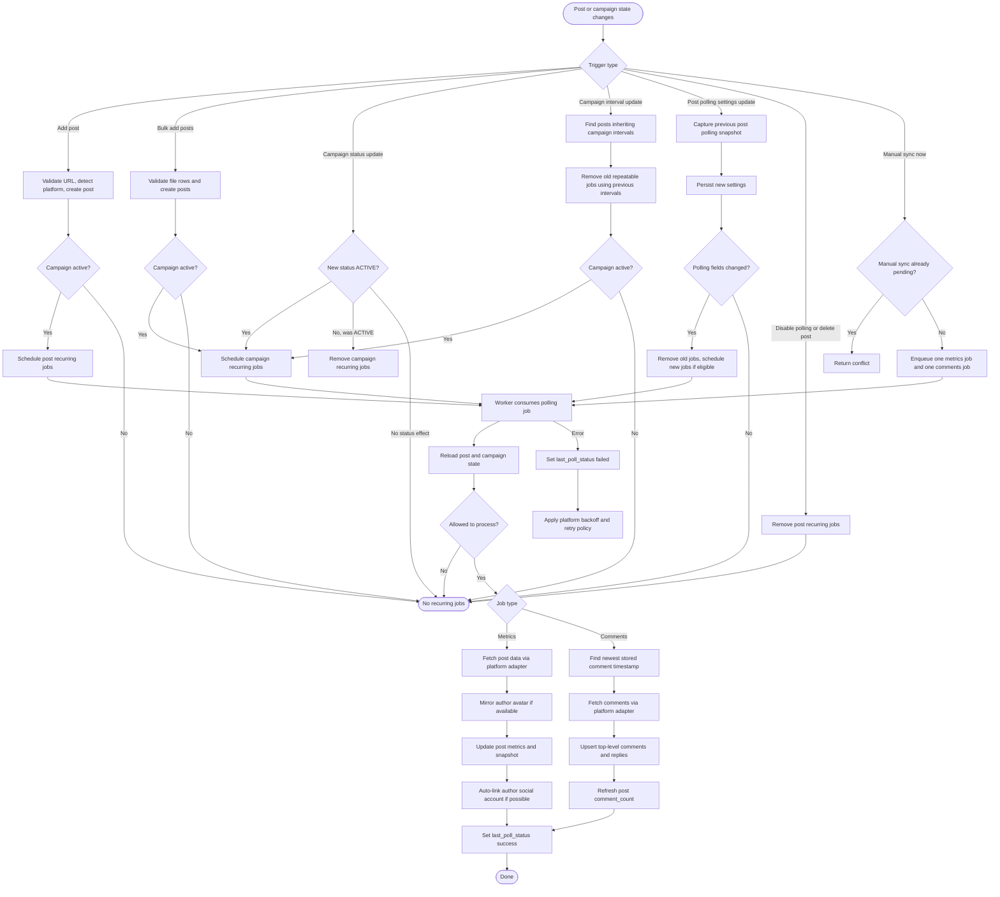

# Post Polling Technical Document

This document describes the post polling subsystem for YeHub campaign posts. In the codebase the feature is implemented as **post polling**, not "pool post"; this document uses the implementation name.

Post polling periodically synchronizes public social post metrics and comments into YeHub. It also supports a manual "sync now" action for a single post.

## Scope

Post polling covers these responsibilities:

- Create or remove BullMQ jobs when campaign or post state changes.
- Resolve metric and comment polling intervals from post overrides, campaign defaults, and module defaults.
- Fetch post metrics and comments from the scraper proxy through platform adapters.
- Persist denormalized post metrics, comment threads, author data, and polling status.
- Expose post polling controls through backend APIs and frontend API clients.

The subsystem does not decide campaign authorization, project membership, or UI rendering. Those concerns remain in the campaign, auth, and frontend layers.

## Main Components

| Layer | Component | Responsibility |
| --- | --- | --- |
| Backend API | `PostsController` | Exposes post creation, settings, polling toggle, sync, listing, detail, bulk upload, and delete endpoints. |
| Domain service | `PostsService` | Validates post URLs, applies post settings, handles delete, and invokes the polling scheduler when post state changes. |
| Campaign service | `CampaignsService` | Invokes scheduler changes when campaign status or inherited polling intervals change. |
| Scheduler | `PollingSchedulerService` | Converts campaign/post state into BullMQ repeatable jobs or one-off manual jobs. |
| Queue | `polling-fetch` | Stores metric and comment jobs. |
| Worker | `PollingProcessor` | Consumes jobs, fetches data through adapters, and writes results to the database. |
| Platform layer | `PlatformAdapterRegistry` and adapters | Normalizes platform-specific scraper responses into canonical metric and comment payloads. |
| External service | `ScraperProxyClient` | Sends authenticated requests to the scraper proxy. |
| Frontend API | `yehub-fe/src/api/posts.ts` | Provides typed client calls for post settings, polling toggle, and manual sync. |

## Data Model

The subsystem uses these database fields:

| Model | Field | Meaning |
| --- | --- | --- |
| `Campaign` | `status` | Only `ACTIVE` campaigns are eligible for recurring polling. |
| `Campaign` | `metric_polling_interval` | Default metric interval in seconds for posts in the campaign. |
| `Campaign` | `comments_polling_interval` | Default comment interval in seconds for posts in the campaign. |
| `Post` | `polling_enabled` | Per-post recurring polling switch. |
| `Post` | `polling_metric_override` | Optional post-level metric interval override. |
| `Post` | `polling_comment_override` | Optional post-level comment interval override. |
| `Post` | `last_polled_at` | Timestamp of the most recent polling attempt. |
| `Post` | `last_poll_status` | Last polling result, currently `success` or `failed`. |
| `Post` | `metrics_snapshot` | Raw and normalized metric snapshot from the scraper proxy. |
| `Post` | `likes`, `shares`, `views`, `comment_count`, `published_at`, `content`, `author_name`, `author_avatar`, `platform_post_id` | Denormalized fields refreshed by metric polling. |
| `Comment` | `platform_comment_id`, `parent_comment_id`, `platform_created_at`, counts and author fields | Comment data upserted by comment polling. |

## Interval Resolution

Metric and comment intervals are resolved independently:

```text
post override -> campaign default -> module default
```

The module defaults are:

- Metrics: `86400` seconds.
- Comments: `86400` seconds.

If a post has `polling_metric_override = null`, it inherits the campaign metric interval. If the campaign interval is also null, the module default is used. The same rule applies to comment polling.

## Backend API Surface

| Method | Path | Purpose |
| --- | --- | --- |
| `POST` | `/campaigns/:campaignId/posts` | Add a single post by URL. Schedules recurring polling if the campaign is active. |
| `POST` | `/campaigns/:campaignId/posts/bulk` | Add multiple posts from CSV or Excel. Schedules campaign polling when posts are added to an active campaign. |
| `GET` | `/campaigns/:campaignId/posts` | List campaign posts, including polling fields. |
| `GET` | `/posts` | List posts across all visible campaigns. |
| `GET` | `/posts/:id` | Get post detail, including polling state and last sync state. |
| `PUT` | `/posts/:id/settings` | Update polling mode, interval overrides, and KPI targets. Reschedules the post when polling fields change. |
| `PUT` | `/posts/:id/polling` | Enable or disable recurring polling for a post. |
| `POST` | `/posts/:id/sync` | Queue an immediate metric and comment poll for a post. |
| `DELETE` | `/posts/:id` | Remove recurring polling jobs and delete the post. |

## Scheduling Rules

Recurring jobs are scheduled only when:

- The post exists.
- The post is not deleted.
- `Post.polling_enabled` is true.
- `Campaign.status` is `ACTIVE`.

Manual sync jobs are different. They still require a valid, non-deleted post with a URL, but they bypass the recurring polling enabled and active-campaign gate in the worker.

Scheduler behavior:

- Adding a post to an active campaign calls `schedulePost`.
- Bulk adding posts to an active campaign calls `scheduleCampaign`.
- Changing a campaign from another status to `ACTIVE` calls `scheduleCampaign`.
- Changing a campaign out of `ACTIVE` calls `removeCampaign`.
- Changing campaign polling intervals calls `rescheduleCampaignInheritedPosts` for posts without overrides.
- Changing post interval overrides or polling mode calls `reschedulePost`.
- Disabling post polling calls `removePost`.
- Deleting a post calls `removePost` before deletion.
- Manual sync calls `triggerImmediate`, which enqueues one metrics job and one comments job if neither manual job is already pending.

## Queue Jobs

The polling queue name is `polling-fetch`.

Recurring jobs:

| Job name | Job type | Job ID |
| --- | --- | --- |
| `poll-post-metrics` | Metrics | `post:{postId}:metrics` |
| `poll-post-comments` | Comments | `post:{postId}:comments` |

Manual jobs:

| Job name | Job type | Job ID |
| --- | --- | --- |
| `poll-post-metrics` | Metrics | `post:{postId}:manual-metrics` |
| `poll-post-comments` | Comments | `post:{postId}:manual-comments` |

Recurring jobs use BullMQ repeat options with `repeat.every = intervalSeconds * 1000`. Because BullMQ repeatable job removal depends on the same repeat interval used at creation time, rescheduling must remove the old interval snapshot before adding the new interval snapshot.

## Activity Diagram



## Worker Execution

The worker consumes `polling-fetch` jobs and maps the job name to either `metrics` or `comments`.

Before fetching external data, the worker reloads the post and checks:

- The post exists.
- The post is not deleted.
- The post has a URL.
- For recurring jobs only: polling is enabled and the campaign is active.

Metrics jobs:

1. Resolve the platform adapter from the post platform.
2. Fetch post data from the scraper proxy.
3. Mirror the author avatar through `UploadsService` when present.
4. Update post fields such as content, author, likes, shares, views, comments, published date, platform post ID, and `metrics_snapshot`.
5. Mark `last_polled_at` and `last_poll_status = success`.
6. Attempt to auto-link the post author to a social account/profile.

Comment jobs:

1. Find the newest stored `Comment.platform_created_at` for the post.
2. Fetch comments since that timestamp.
3. Flatten nested replies.
4. Upsert top-level comments first.
5. Upsert replies after resolving parent comment IDs.
6. Recalculate `Post.comment_count` from stored comments.
7. Mark `last_polled_at` and `last_poll_status = success`.

On failure, the worker updates `last_polled_at` and `last_poll_status = failed`, logs the platform error code and retry delay, then rethrows so BullMQ can retry.

## Error Handling and Backoff

Polling jobs use:

- `attempts = 3`
- platform backoff base delay = `60000` ms
- exponential backoff for normal failures
- exact `Retry-After` handling for platform rate-limit failures when available

Scraper proxy failures are normalized into `PlatformError` codes:

| Code | Meaning |
| --- | --- |
| `AUTHENTICATION_FAILED` | Missing or invalid scraper proxy credentials. |
| `RATE_LIMITED` | Proxy returned rate limiting information. |
| `NOT_FOUND` | The external post or comments endpoint returned not found. |
| `TIMEOUT` | Request timed out. |
| `BAD_RESPONSE` | Response was invalid or not usable. |
| `PROXY_ERROR` | Proxy or network failure. |
| `UNKNOWN` | Catch-all for unexpected platform errors. |

## Configuration

Required scraper proxy configuration:

```text
SCRAPER_PROXY_BASE_URL
SCRAPER_PROXY_API_KEY
```

Optional timeout configuration:

```text
SCRAPER_PROXY_TIMEOUT_MS
SCRAPER_PROXY_TIMEOUT_FACEBOOK_MS
SCRAPER_PROXY_TIMEOUT_INSTAGRAM_MS
SCRAPER_PROXY_TIMEOUT_TIKTOK_MS
SCRAPER_PROXY_TIMEOUT_YOUTUBE_MS
SCRAPER_PROXY_TIMEOUT_THREADS_MS
```

Worker concurrency is controlled by:

```text
POLLING_PROCESSOR_CONCURRENCY
```

If unset, the current processor defaults to `1`.

## Operational Notes

- Recurring polling stops when a campaign leaves `ACTIVE`, when a post is disabled, or when the post is deleted.
- Manual sync can run even if recurring polling is disabled, as long as the post exists and has a URL.
- Repeatable job removal must use the old interval values. Callers should capture previous snapshots before updating interval fields.
- Comment polling is incremental and uses the newest stored `platform_created_at` as the cursor hint.
- Adapter normalization keeps platform payload differences out of the scheduler and processor.
- `last_poll_status` reflects the last attempted job, not separate metric and comment statuses.

## Test Coverage

Relevant tests are located in the backend package:

- `src/polling/polling-scheduler.service.spec.ts`
- `src/polling/polling-processor.spec.ts`
- `src/polling/adapters/base-platform.adapter.spec.ts`
- `src/posts/posts.service.spec.ts`

Suggested verification command:

```bash
cd yehub-be
pnpm test -- polling
pnpm test -- posts.service
```
